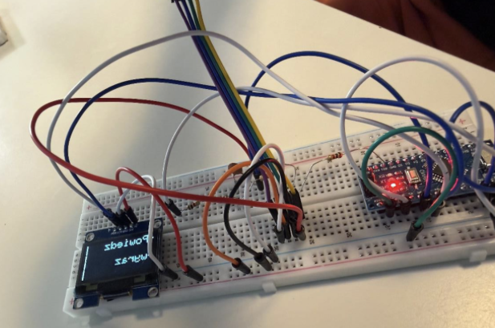
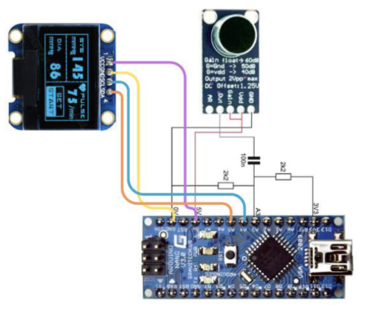

# 🇵🇱 Autonomiczny System Rozpoznawania Mowy (Arduino)

*(🇬🇧 English version below)*

System rozpoznawania wyrazów działający w pełni autonomicznie na Arduino. Układ próbkuje dźwięk z mikrofonu, przetwarza go za pomocą cyfrowych filtrów pasmowych i analizy przejść przez zero, a następnie porównuje z wgranymi wzorcami, wyświetlając wynik na ekranie OLED.

---

## 📸 Wygląd i schemat układu

  <table>
    <tr>
      <td align="center" width="50%">
        <strong>Zdjęcie prototypu</strong>  
        
      </td>
      <td align="center" width="50%">
        <strong>Schemat ideowy</strong>  
        
      </td>
    </tr>
  </table>

---

## 🛠 Wykorzystane komponenty

* **Mikrokontroler** (Arduino Nano)
* **Moduł mikrofonu** (z regulacją wzmocnienia i offsetem DC)
* **Wyświetlacz OLED** (I2C) do prezentacji komunikatów i wyniku
* **Elementy bierne**: Rezystory (2k2), kondensator (100n)

📌 **Dodatkowe pliki w repozytorium:**
* **Szczegółowy opis:** [`opis_projektu.pdf`](./opis_projektu.pdf)
* **Kod źródłowy:** folder [`src/`](./src/)

---

## ⚙️ Koncepcja działania

1. **Próbkowanie dźwięku**: Sygnał z mikrofonu jest analizowany w czasie rzeczywistym przez przetwornik ADC. Po przekroczeniu progu głośności nagranie dzielone jest na **13 segmentów czasowych**.
2. **Ekstrakcja cech**: Dla każdego segmentu wyodrębniane są cechy charakterystyczne za pomocą cyfrowych filtrów pasmowych i analizy przejść przez zero (macierz liczb).
3. **Algorytm dopasowywania**: Odcisk głosu jest porównywany z 10 zapisanymi wzorcami z uwzględnieniem odchylenia standardowego i przesunięć czasowych.
4. **Prezentacja wyniku**: Najlepiej dopasowany wzorzec jest natychmiast wyświetlany na ekranie OLED.

---

## 🧠 Proces treningu i słownik

Wzorce bazują na 10 słowach: 
`URUCHOM`, `DOM`, `POCZĄTEK`, `DZIESIĘĆ`, `JEDEN`, `LUSTRO`, `SZAFA`, `PRAWO`, `MYSZ`, `SZNUR`.

* **Zbiórka danych**: Słowa były wielokrotnie wypowiadane, a surowe macierze cech przesyłano przez port szeregowy do komputera.
* **Generowanie wzorców**: Dane uśredniono i wyznaczono dla nich odchylenia standardowe.
* **Implementacja (PROGMEM)**: Wygenerowane statystyki zapisano w pliku nagłówkowym `Templates.h` w pamięci flash (`PROGMEM`), co pozwoliło oszczędzić pamięć RAM mikrokontrolera.

---

## 📚 Źródła

Projekt został zrealizowany na podstawie artykułu, który można znaleźć pod następującym linkiem:
[Speech Recognition With an Arduino Nano - Instructables](https://www.instructables.com/Speech-Recognition-With-an-Arduino-Nano/)

  

---
---

# 🇬🇧 Autonomous Speech Recognition System (Arduino)

A word recognition system operating fully autonomously on an Arduino. The device samples sound from a microphone, processes it using digital band-pass filters and zero-crossing analysis, and then compares it with pre-loaded templates, displaying the result on an OLED screen.

---

## 📸 Appearance and Circuit Diagram

  <table>
    <tr>
      <td align="center" width="50%">
        <strong>Prototype Photo</strong>  
        
      </td>
      <td align="center" width="50%">
        <strong>Circuit Diagram</strong>  
        
      </td>
    </tr>
  </table>

---

## 🛠 Components Used

* **Microcontroller** (Arduino Nano)
* **Microphone module** (with gain control and DC offset)
* **OLED Display** (I2C) for messages and result presentation
* **Passive components**: Resistors (2k2), capacitor (100n)

📌 **Additional files in the repository:**
* **Detailed description (in Polish):** [`opis_projektu.pdf`](./opis_projektu.pdf)
* **Source code:** [`src/`](./src/) folder

---

## ⚙️ Concept of Operation

1. **Sound sampling**: The microphone signal is analyzed in real-time by the ADC. After exceeding the volume threshold, the recording is divided into **13 time segments**.
2. **Feature extraction**: Characteristic features are extracted for each segment using digital band-pass filters and zero-crossing analysis (resulting in a number matrix).
3. **Matching algorithm**: The voiceprint is compared with 10 saved templates, taking into account standard deviation and time shifts.
4. **Result presentation**: The best-matched template is immediately displayed on the OLED screen.

---

## 🧠 Training Process and Vocabulary

The templates are based on 10 Polish words:
`URUCHOM` (Start), `DOM` (House), `POCZĄTEK` (Beginning), `DZIESIĘĆ` (Ten), `JEDEN` (One), `LUSTRO` (Mirror), `SZAFA` (Wardrobe), `PRAWO` (Right), `MYSZ` (Mouse), `SZNUR` (Cord).

* **Data collection**: Words were spoken multiple times, and raw feature matrices were sent via the serial port to a computer.
* **Template generation**: Data was averaged and standard deviations were calculated.
* **Implementation (PROGMEM)**: The generated statistics were saved in the `Templates.h` header file in flash memory (`PROGMEM`), which saved the microcontroller's RAM.

---

## 📚 Sources

The project was implemented based on the article available at the following link:
[Speech Recognition With an Arduino Nano - Instructables](https://www.instructables.com/Speech-Recognition-With-an-Arduino-Nano/)
